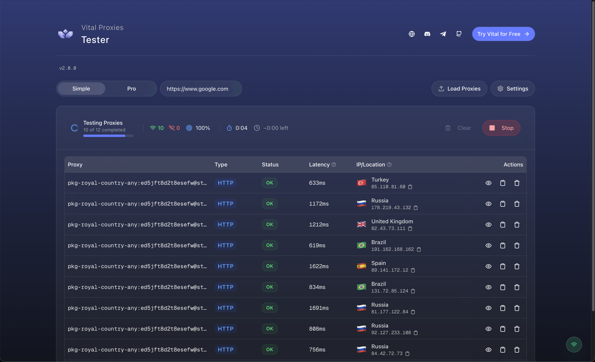

<div align="center">
  
  <h1 align="center">Illuminati Proxy Tester</h1>
  <p align="center">
    A modern, open-source desktop application for testing and validating proxy lists with real-time results.
  </p>
</div>

<p align="center">
  <a href="https://github.com/alphajew420/proxy-tester/releases/latest">
    
  </a>
</p>

<p align="center">
  <a href="#installation--usage">Installation Guide</a>
  ·
  <a href="https://github.com/alphajew420/proxy-tester/issues">Report a Bug</a>
  ·
  <a href="https://github.com/alphajew420/proxy-tester/issues">Request a Feature</a>
</p>

---



---

## About

Illuminati Proxy Tester is a powerful yet simple tool built for anyone who works with proxies. Developed with a modern tech stack (Next.js, Tauri, and Zustand), it provides a fast, beautiful, and intuitive cross-platform experience.

No more slow or clunky testing tools. Get instant feedback with a detailed, real-time analysis for each proxy in your list.

### Key Features

- **High-Performance Testing:** Asynchronously tests proxies with a configurable concurrency limit to get results fast.
- **Multi-Protocol Support:** Automatically detects and tests for HTTP, HTTPS, SOCKS4, and SOCKS5 protocols to correctly validate any type of proxy.
- **Geo-IP Data:** For each successful proxy, view Status, Latency (TTFB), IP Address, Country, City, and ISP.
- **Smart & Interactive UI:**
  - **Auto-Parsing:** Paste your list in almost any common format (`host:port:user:pass`, `user:pass@host:port`, etc.) and the app handles it.
  - **Easy Actions:** Copy proxy strings/IPs, view detailed breakdowns, and manage your results with a single click.
- **Automatic Updates:** The app notifies you when a new version is available, so you're always up-to-date.
- **Cross-Platform:** Works seamlessly on macOS, Windows, and Linux.
- **Pro Mode:** Advanced diagnostics like DNS timing, TCP handshake duration, proxy auth time, and more. For power users and professionals.

---

## Installation & Usage

Builds are published to the [Releases page](https://github.com/alphajew420/proxy-tester/releases/latest). Pick the asset matching your OS / arch:

| Platform     | Architecture    | File Type   |
| :----------- | :-------------- | :---------- |
| Windows      | 64-bit (x64)    | `.exe` / `.msi` |
| macOS        | Apple Silicon   | `.dmg`      |
| macOS        | Intel           | `.dmg`      |
| Linux        | Universal (x64) | `.AppImage` |
| Linux        | Debian-based    | `.deb`      |
| Linux        | RHEL-based      | `.rpm`      |

> **macOS Gatekeeper note:** the first time you run the app, right-click the application icon and choose **Open**, then click **Open** again in the security prompt. You only need to do this once.

Once installed, paste your proxy list, configure your options, and click "Run Test".

---

## Development & Contribution

Contributions are welcome — bug fixes, features, or documentation improvements.

### Prerequisites

- [**Node.js**](https://nodejs.org/) (v20 or higher)
- [**Yarn**](https://yarnpkg.com/)
- [**Rust**](https://www.rust-lang.org/) and Cargo
- [**Tauri Prerequisites**](https://tauri.app/start/prerequisites/) for your specific OS.

### Local Development Setup

1. **Clone the repository:**
   ```sh
   git clone https://github.com/alphajew420/proxy-tester.git
   cd proxy-tester
   ```
2. **Install dependencies:**
   ```sh
   yarn install
   ```
3. **Run the development server:**
   ```sh
   yarn tauri dev
   ```

### How to Contribute

Standard GitHub Fork & Pull Request workflow plus [Conventional Commits](https://www.conventionalcommits.org/en/v1.0.0/) on commit messages.

1. **Find or Create an Issue** on the [Issues Page](https://github.com/alphajew420/proxy-tester/issues) before starting work.
2. **Fork & branch:**
   ```sh
   git checkout -b feature/MyAmazingFeature
   ```
3. **Commit:**
   ```sh
   git commit -m 'feat: Add sorting to the results table'
   ```
4. **Open a Pull Request** and link the relevant issue.

---

## Connect with Illuminati Networks

- **Website:** [illuminatinetworks.com](https://illuminatinetworks.com)
- **Discord:** [discord.gg/xFUTn7687u](https://discord.gg/xFUTn7687u)
- **Telegram:** [t.me/illuminatinetworks](https://t.me/illuminatinetworks)
- **GitHub:** [github.com/alphajew420](https://github.com/alphajew420)

---

This project is a rebrand of an upstream MIT-licensed open-source proxy tester. Full attribution for the original authors is preserved in [`NOTICE`](./NOTICE) and [`LICENSE`](./LICENSE) as required by the MIT License.
